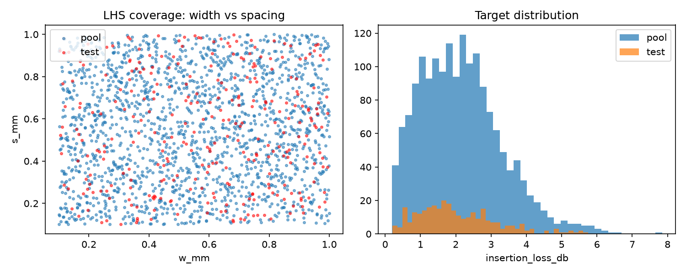

# TabPFN SI/PI Regression Pipeline

A reproducible Python workflow for studying few-shot regression on a **synthetic coupled-microstrip insertion-loss** task. It generates a fixed design dataset, compares several regressors at small training budgets, and creates evaluation summaries and plots.

> **Scope:** The target values come from a deterministic, closed-form physics approximation. This project does not run a full-wave electromagnetic solver and does not use measured hardware data.

## At a glance

| | |
|---|---|
| **Target** | Insertion loss, in dB |
| **Inputs** | `w_mm`, `s_mm`, `h_mm`, `er`, `t_um`, and `len_mm` |
| **Regressors** | TabPFN, XGBoost, multilayer perceptron (MLP), and Gaussian process (GP) |
| **Training budgets** | 10, 20, 50, 100, and 200 samples |
| **Evaluation** | A fixed 300-row held-out test set |

## How the pipeline works

1. **Generate data** — Latin hypercube sampling creates 2,000 design points. The fixed seed (42) splits them into a 1,700-row training pool and a 300-row test set.
2. **Run experiments** — Each model trains on matched random subsets from the pool and is scored on the same test set. The 50-sample budget uses 30 seeds; other budgets use 10.
3. **Summarize results** — The plotting script writes learning curves, metric tables, uncertainty summaries (when available), and paired TabPFN–GP comparisons.

## Quick start

From the repository root, create and activate a virtual environment, then install the dependencies:

```bash
python -m venv .venv
```

**Windows PowerShell**

```powershell
.\.venv\Scripts\Activate.ps1
pip install -r requirements.txt
```

**macOS / Linux**

```bash
source .venv/bin/activate
pip install -r requirements.txt
```

Run the scripts in order:

```bash
python 01_generate_data.py
python 02_run_experiment.py
python 03_plot_results.py
```

Run commands from the repository root. The scripts regenerate the data and output files in place.

## TabPFN access

TabPFN may require an account, license acceptance, and model-access token. Configure access according to TabPFN's current instructions before running the comparison. The experiment script checks for `TABPFN_TOKEN` (or a locally saved TabPFN token); if no usable access is available, it skips TabPFN and runs the other available models. **Keep tokens out of this repository.**

PowerShell example for the current terminal session:

```powershell
$env:TABPFN_TOKEN = "your-token"
python 02_run_experiment.py
```

## Project layout

```text
.
├── 01_generate_data.py       # Generate the design pool and held-out set
├── 02_run_experiment.py      # Train and evaluate the regressors
├── 03_plot_results.py        # Create plots and metric summaries
├── physics.py                # Deterministic coupled-microstrip model
├── requirements.txt
├── data/                     # Generated pool and fixed test set
├── results/                  # Raw runs, aggregate metrics, and tables
├── figures/                  # PNG plots
└── output/pdf/                # PDF versions of plots
```

## Included outputs

### Design-space preview

The figure shows the generated pool and fixed test split.



- `data/pool.csv`, `data/test.csv` — generated inputs and target values.
- `results/raw_results.csv` — per-model, per-budget, per-seed metrics and timings.
- `results/metrics_by_budget.csv`, `results/summary_table.*` — aggregate metrics.
- `results/tabpfn_vs_gp_paired_tests.csv` — paired RMSE comparisons, when both models have results.
- `results/uncertainty_calibration.csv` — prediction-interval summaries, when available.
- `figures/` and `output/pdf/` — design-space and evaluation plots.

The current generated data, results, and plots are committed as a reproducibility snapshot. Rerunning the pipeline can replace them.

## Method notes and limitations

- `physics.py` uses closed-form microstrip and coupled-mode approximations with fixed model assumptions; outputs should be treated as synthetic proxy labels.
- The benchmark compares models on this generated distribution and fixed test set. It does not establish performance on measured boards or other electromagnetic geometries.
- TabPFN results depend on the installed package, available model access, and local hardware. The script can omit TabPFN if access is missing.
